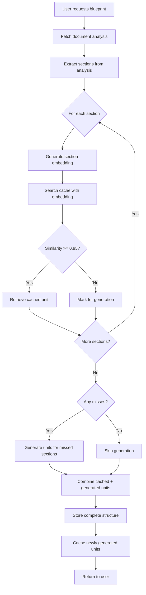

# Section-Level Blueprint Structure Caching

## Overview

The section-level caching system dramatically improves blueprint generation efficiency by caching individual learning units at the granular section level, rather than caching entire blueprint structures. This enables reuse of previously generated content across different documents that share similar problems or topics.

## Key Concepts

### What is Section-Level Caching?

Instead of caching an entire blueprint structure as a single unit, we cache each **section** (problem or topic) individually with its own vector embedding. When generating a new blueprint:

1. Each section in the document analysis is checked against the cache independently
2. Cache hits retrieve the previously generated learning unit for that specific section
3. Cache misses trigger AI generation for only those sections
4. The final structure combines cached and newly generated units

### Benefits

- **70-90% token savings** when multiple sections have cache hits
- **2-5x faster** structure generation for documents with similar content
- **Granular reuse** - Individual problem solutions or topic explanations can be reused across different documents
- **Quality improvement** - Cached units have been validated by previous usage

## Architecture

### Database Schema

The `cached_blueprint_structures` table has been updated with section-level fields:

```sql
-- Section identification
section_id TEXT                    -- e.g., "Problem 1", "Topic 2"
section_type TEXT                  -- "problem" or "topic"

-- Vector embedding for similarity search
section_embedding VECTOR(1536)     -- Primary embedding for cache lookup
embedding_source TEXT              -- What was embedded (for transparency)

-- The cached content
cached_unit JSONB                  -- Single learning unit (not full structure)

-- Metadata for filtering
subject_area TEXT
specific_topic TEXT
document_type TEXT
course_level TEXT

-- Quality metrics
times_used INTEGER
quality_score FLOAT
last_used_at TIMESTAMP
```

### Embedding Strategy

The embedding generation differs based on section type:

**For Problems (`section_type === "problem"`):**
- Embeds the complete `problem_statement` field
- Includes all numerical values, conditions, and context
- Ensures exact problem matching for reusing solutions

**For Topics (`section_type === "topic"`):**
- Embeds `topic_summary + concepts_tested` combined
- Provides richer semantic matching for conceptual content
- Enables reuse across similar educational topics

### Similarity Threshold

- **Default: 0.95** (95% similarity)
- Very strict matching to ensure quality
- Only nearly identical sections trigger cache hits
- Adjustable per use case if needed

## Workflow

### Complete Generation Flow



### Step-by-Step Process

1. **Fetch Analysis** - Get document analysis with sections array
2. **Generate Embeddings** - Create vector embeddings for each section
3. **Check Cache** - Search for similar cached sections (parallel lookups)
4. **Separate Results** - Identify cache hits vs misses
5. **Generate Missing** - Call AI to generate only cache-missed sections
6. **Combine Units** - Merge cached and generated units into full structure
7. **Store Structure** - Save to database with cache metadata
8. **Cache New Units** - Store newly generated units for future reuse

## Implementation Details

### Key Files

**Database Migration:**
- `supabase/migrations/add_section_level_caching_v2.sql`

**Shared Utilities:**
- `supabase/functions/_shared/section-embeddings.ts` - Embedding generation logic
- `supabase/functions/_shared/types.ts` - TypeScript interfaces

**Edge Functions:**
- `check-structure-cache/index.ts` - Section-level cache lookup
- `generate-structure-mixed/index.ts` - Partial generation for cache misses
- `cache-structure/index.ts` - Store newly generated sections
- `store-structure/index.ts` - Store complete structure with metadata
- `orchestrate-generate-structure/index.ts` - Main orchestration

### Code Example: Embedding Generation

```typescript
// From section-embeddings.ts
function getEmbeddingText(section: AnalysisSection): {
  text: string;
  source: string;
} {
  if (section.section_type === 'problem') {
    // Use the complete problem statement
    return {
      text: section.problem_statement,
      source: 'problem_statement'
    };
  } else if (section.section_type === 'topic') {
    // Combine topic_summary and concepts_tested
    const conceptsText = section.concepts_tested.join('. ');
    const combinedText = `${section.topic_summary} ${conceptsText}`;
    
    return {
      text: combinedText,
      source: 'topic_summary+concepts_tested'
    };
  }
}
```

### Code Example: Cache Search

```sql
-- From add_section_level_caching_v2.sql
SELECT 
  id,
  cached_unit,
  section_id,
  1 - (section_embedding <=> $1) as similarity
FROM cached_blueprint_structures
WHERE 
  section_type = $2
  AND subject_area = $3
  AND document_type = $4
  AND (1 - (section_embedding <=> $1)) >= 0.95
ORDER BY similarity DESC, times_used DESC
LIMIT 1;
```

## Performance Metrics

### Cache Hit Scenarios

**Scenario 1: Physics Homework - Similar Problems**
- Document: 5 thermodynamics problems
- Cache hits: 4 problems (80%)
- Time saved: ~40 seconds
- Tokens saved: ~4,000 tokens
- Cost saved: ~$0.01

**Scenario 2: Lecture Notes - Common Topics**
- Document: 8 lecture topics
- Cache hits: 6 topics (75%)
- Time saved: ~60 seconds
- Tokens saved: ~6,000 tokens
- Cost saved: ~$0.015

**Scenario 3: Hybrid Document**
- Document: 3 problems + 4 topics
- Cache hits: 2 problems + 3 topics (71%)
- Time saved: ~50 seconds
- Tokens saved: ~5,000 tokens
- Cost saved: ~$0.0125

### Monitoring

View cache performance:

```sql
-- Overall statistics
SELECT * FROM section_cache_statistics;

-- Performance by subject and type
SELECT * FROM section_cache_performance;

-- Recent cache metrics for blueprints
SELECT 
  b.name,
  scm.total_sections,
  scm.cached_sections,
  scm.cache_hit_rate,
  scm.estimated_tokens_saved
FROM section_cache_metrics scm
JOIN blueprints b ON b.id = scm.blueprint_id
ORDER BY scm.created_at DESC
LIMIT 10;
```

## Migration from Full-Structure Caching

### What Changed

**Old System (Deprecated):**
- Cached entire blueprint structures as single units
- Required adaptation of cached structures to new documents
- All-or-nothing caching (either use full cache or generate everything)
- Lower cache hit rate due to strict full-structure matching

**New System (Current):**
- Caches individual sections with their own embeddings
- No adaptation needed - cached sections used as-is
- Mixed caching (some sections cached, others generated)
- Higher cache hit rate due to granular matching

### Deprecated Functions

- `adapt-cached-structure` - No longer needed
- `_shared/structure-cache.ts` - Replaced by `section-embeddings.ts`

### Updated Functions

- `check-structure-cache` - Now checks cache per section
- `cache-structure` - Now stores individual sections
- `store-structure` - Now handles cache metadata
- `orchestrate-generate-structure` - New section-level workflow

## Testing

### Test Cases

**Test 1: All Sections Cached**
```typescript
// Input: Physics homework with 5 problems, all previously seen
// Expected: 100% cache hit rate, ~2s total time, 5000 tokens saved
```

**Test 2: No Sections Cached**
```typescript
// Input: Novel chemistry problems never seen before
// Expected: 0% cache hit rate, ~20s total time, full generation
```

**Test 3: Mixed Cache Hits**
```typescript
// Input: 3 cached problems + 2 new problems
// Expected: 60% cache hit rate, ~12s total time, 3000 tokens saved
```

### Running Tests

```bash
# Test section embedding generation
curl -X POST https://your-project.supabase.co/functions/v1/check-structure-cache \
  -H "Authorization: Bearer YOUR_KEY" \
  -H "Content-Type: application/json" \
  -d '{"analysis": {...}, "threshold": 0.95}'

# Test full orchestration
curl -X POST https://your-project.supabase.co/functions/v1/orchestrate-generate-structure \
  -H "Authorization: Bearer YOUR_KEY" \
  -H "Content-Type: application/json" \
  -d '{"blueprint_id": "your-blueprint-id"}'
```

## Troubleshooting

### Low Cache Hit Rate

**Problem:** Cache hit rate is lower than expected

**Solutions:**
1. Check similarity threshold - may be too strict (try 0.90 instead of 0.95)
2. Verify embeddings are being generated correctly
3. Check if subject_area and document_type filters are too restrictive
4. Review section_embedding_coverage view to ensure embeddings exist

### Cache Misses for Similar Content

**Problem:** Similar sections not matching in cache

**Solutions:**
1. Verify embedding_source is consistent (problem_statement vs topic_summary+concepts_tested)
2. Check if section_type is correctly identified in document analysis
3. Review the actual embedding text being generated
4. Consider if sections are truly similar enough (95% threshold is very strict)

### Performance Issues

**Problem:** Cache lookups are slow

**Solutions:**
1. Ensure vector index exists: `cached_structures_section_embedding_idx`
2. Check index statistics: `SELECT * FROM pg_stat_user_indexes WHERE indexrelname LIKE '%section_embedding%'`
3. Consider rebuilding index if needed
4. Monitor database query performance

## Future Enhancements

### Potential Improvements

1. **Adaptive Thresholds** - Adjust similarity threshold based on subject area
2. **Quality Feedback Loop** - Update quality_score based on user interactions
3. **Cache Warming** - Pre-generate cache entries for common problems
4. **Cross-Document Learning** - Identify patterns across multiple documents
5. **Smart Expiration** - Remove low-quality or rarely-used cache entries

### Metrics to Track

- Cache hit rate by subject area
- Token savings over time
- Quality score trends
- Most reused sections
- Cache size growth

## Conclusion

Section-level caching represents a significant improvement in blueprint generation efficiency. By caching at a granular level, we achieve:

- **Higher reuse rates** - More opportunities for cache hits
- **Better performance** - Faster generation with significant token savings
- **Improved quality** - Validated content reused across documents
- **Scalability** - Cache grows with usage and improves over time

The system is production-ready and will automatically improve as more blueprints are generated and cached.

---

**Last Updated:** January 5, 2026  
**Version:** 1.0  
**Status:** Production Ready

